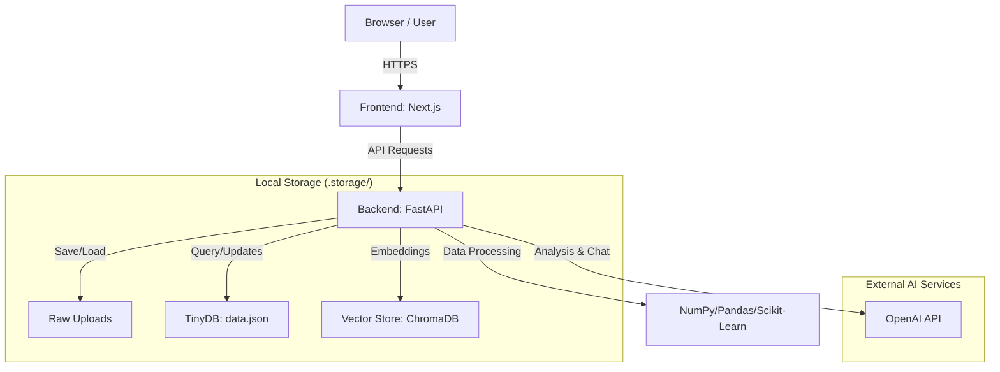

# AI Data Analysis Platform - User Manual

Welcome to the **AI Data Analysis Platform**. This platform provides automated insights, interactive dashboards, and time-series forecasting for your business data using advanced AI and machine learning.

---

## 🏗 System Architecture



---

## 🚀 Getting Started

### Prerequisites
- **Python 3.10+**
- **Node.js 18+**
- **OpenAI API Key**

### Installation

1. **Backend Setup**:
   ```bash
   cd backend
   python -m venv .venv
   source .venv/bin/activate  # On Windows: .venv\Scripts\activate
   pip install -r requirements.txt
   ```

2. **Frontend Setup**:
   ```bash
   cd frontend
   npm install
   ```

### Data Storage
By default, the application stores data in the `backend/.storage` directory:
- **Raw Uploads**: `.storage/uploads/` (Original files)
- **Vector Store**: `.storage/vectorstore/` (Embeddings for AI analysis)
- **Database**: `.storage/data.json` (File metadata and chat history)

### Configuration
Create a `.env` file in the `backend` directory:
```env
OPENAI_API_KEY=your_key_here
UPLOAD_DIR=./.storage/uploads
VECTORSTORE_DIR=./.storage/vectorstore
MAX_FILE_SIZE_MB=50
ALLOWED_ORIGINS=http://localhost:3000
```

### Starting the Servers

- **Backend**:
  ```bash
  cd backend
  source .venv/bin/activate
  uvicorn app.main:app --host 0.0.0.0 --port 8000 --reload
  ```

- **Frontend**:
  ```bash
  cd frontend
  npm run dev
  ```
The app will be available at [http://localhost:3000](http://localhost:3000).

---

## 🛠 Core Workflows

### 1. File Upload
Upload your data files via the drag-and-drop interface.
- **Supported Formats**: `.csv`, `.xlsx`, `.xls`, `.pdf`, `.docx`, `.txt`, `.json`, `.png`, `.jpg`.
- **Note**: PDF and Image files are automatically processed via OCR if needed.

### 2. AI Document Analysis
Once uploaded, click **Analyze** to get:
- **Executive Summary**: A concise overview of the document.
- **Key Insights**: Automatically extracted critical points.
- **Recommendations**: AI-driven business advice based on the content.

### 3. Interactive Dashboard
Generate a comprehensive dashboard from tabular data:
- **Dynamic Charts**: Bar, line, and pie charts based on data trends.
- **Financial Intelligence**: Automated calculation of Revenue, Cost, and Profit Margins.
- **Market Segmentation**: Sophisticated clustering of data points into business segments (e.g., "High-Value Operations").
- **Anomaly Detection**: Identification of statistical outliers in your datasets.

### 4. Time-Series Forecasting
For datasets containing dates and values (like prices or sales):
- **Decomposition**: Separation of Trend, Seasonality, and Residuals.
- **Forecasting**: Advanced predictive modeling using **Facebook Prophet** and Linear Regression for future performance.

### 5. Causal AI & Multi-File Synthesis
- **Causal Analysis**: Move beyond correlation with automated **DAG (Directed Acyclic Graph)** models to identify true cause-and-effect.
- **Data Synthesis**: Upload and correlate multiple disparate datasets (e.g., Marketing Spend vs. Sales) for holistic business analysis.

### 6. Automated Reporting
- **Exporting**: Generate audit-ready **PDF, PowerPoint (PPTX), and Excel (XLSX)** reports containing all AI-generated charts and insights.

---

## � Scientific Methodology

The platform employs professional-grade data science models to ensure accuracy and scale:

### 1. Market Segmentation (Clustering)
- **Model**: `HDBSCAN` (Hierarchical Density-Based Spatial Clustering)
- **Method**: Features are automatically cleaned and normalized using `StandardScaler`. HDBSCAN is used to discover clusters of varying densities and shapes without needing a pre-defined cluster count.
- **Noise Handling**: Unlike KMeans, HDBSCAN identifies **Niche Outliers** (Cluster -1)—data points that don't belong to any specific trend—ensuring main-stream clusters aren't skewed.

### 2. Anomaly Detection
- **Model**: Z-Score Statistical Analysis
- **Threshold**: Values exceeding **2.5 standard deviations** from the mean are flagged as outliers. This is categorized into "Moderate" or "High" severity based on the statistical distance.

### 3. Feature Importance
- **Model**: `Random Forest Regressor`
- **Utility**: Evaluates the predictive power of variables against key targets (like Revenue or Sales).
- **Direction**: Uses **Pearson Correlation** to determine if an influential feature has a "Positive" or "Negative" impact on the target.

### 4. Time-Series Intelligence
- **Decomposition**: `STL Decomposition` via `statsmodels` to isolate underlying trends from seasonal noise.
- **Forecasting**: **Facebook Prophet** is integrated for high-level forecasting, with **Linear Regression** as a fallback for micro-datasets.

### 5. AI Narrative Layer
- **Model**: `OpenAI GPT-4o`
- **Purpose**: Translates abstract clusters and statistics into human-readable business strategy, segment naming, and executive summaries.

---

## �🔍 Troubleshooting

| Issue | Resolution |
| :--- | :--- |
| **Server 500 Error** | Ensure the backend is running and the `.env` file contains a valid OpenAI API key. Check `/tmp/backend_error.log` for details. |
| **Segmentation Issues** | Ensure the dataset has at least 5 numeric rows for valid clustering. Small datasets use reduced `min_cluster_size` automatically. |
| **File Not Found** | Ensure the file upload was successful. Refresh the "Files" list to sync the database. |
| **OCR Failure** | Ensure `pytesseract` and `pdf2image` dependencies are correctly installed on your system. |

---

## 📈 Best Practices
- **Tabular Data**: Use clear column headers (e.g., "Date", "Revenue", "Cost") for optimal financial analysis.
- **Clean Data**: While the system refines data automatically, removing irrelevant rows/columns beforehand improves AI accuracy.
- **Large Files**: For best performance, keep files under the configured `MAX_FILE_SIZE_MB`.

---

## 🚀 Future Roadmap (Data Science v2.0)

As a professional data science platform, we are planning the following enhancements:

1. **Conversational Analytics (NLQ)**: Allowing users to type natural language questions like *"Which region grew the fastest in Q4?"* to generate instant visualizations.
2. **Real-time API Integrations**: Directly connecting to Stripe, Salesforce, and Google Analytics.
3. **Automated Alerting**: Setting up notifications when anomalies or threshold crossings are detected in real-time streams.

---
*Created by Antigravity AI*
